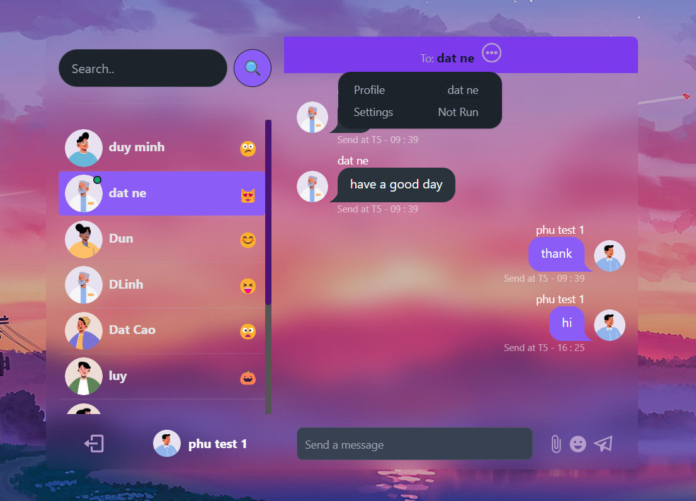

#  Web Chat Online

`✉ A chat website that connects people with noni and exchange stories. `

⚙ Functions of online web chat: 
- 🔑 Create an account, log in, log out.
- 🔍 Search for users ( directly open to the message of the searched user ).
- 🔐 Verify whether the user is online or not (show a green dot if the user is online).
- 👀 View other users' information descriptions.
- 📢 Realtime message, accompanied by message sound and a small animation of the message.
- 🕖 The message section displays the avatar, username as well as the time the message was sent.
- 😆 Gửi emoji cảm xúc cạnh nút gửi tin nhắn.

> 🖼 Image of online web chat


# 🔧 Update code

In `Visual Studio Code's` `Terminal` run this:
```bash
npm run build
```
# 📦 Run

In `Visual Studio Code's` `Terminal` run this:
```bash
npm  start
```

